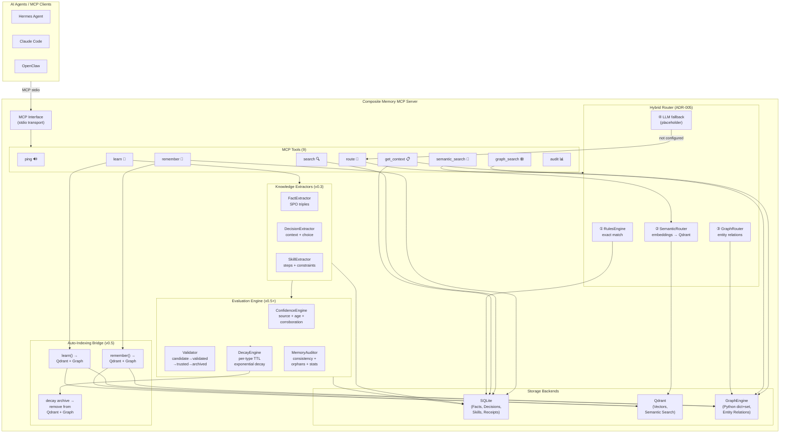

# Composite Memory MCP Server — Architecture Overview



## Data Model (ADR-006)

```
Entity       → {id, type, name, attributes}
Fact         → {subject, predicate, object, confidence, source}
Decision     → {context, choice, rejected_alternatives, reason, source}
Skill        → {name, version, purpose, steps, constraints, validation}
MemoryReceipt→ {id, memory_type, source, created_by, timestamp, confidence,
                verification_status, history}
```

## Verification Lifecycle (v0.5)

```
candidate ──→ validated ──→ trusted ──→ deprecated ──→ archived
  (new)    (conf≥0.7)  (conf≥0.85   (conflict      (TTL expired)
                         + corr≥2)    resolved)
```

## Routing Priority (ADR-005)

```
Query → RulesEngine → SemanticRouter → GraphRouter → LLM fallback
         (exact)      (embeddings)     (relations)    (future)
```

## Tech Stack

| Layer | Technology |
|-------|-----------|
| Language | Python 3.12+ |
| Transport | MCP SDK (stdio) |
| CLI | Typer |
| Data models | Pydantic v2 |
| Facts storage | SQLAlchemy async + aiosqlite |
| Vector search | Qdrant (in-memory / HTTP) |
| Embeddings | sentence-transformers (all-MiniLM-L6-v2) |
| Graph | Pure Python dict+set engine |
| Testing | pytest + pytest-asyncio |
| Linting | ruff |
